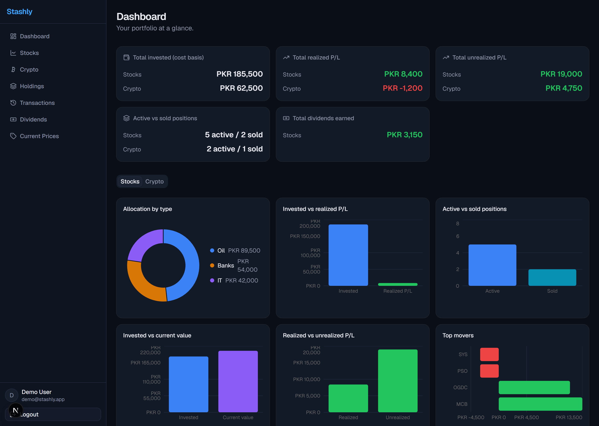

# Stashly

A multi-tenant portfolio tracker for stocks and crypto (PKR only). Track buys and sells with weighted average cost, see realized and unrealized P/L, browse your holdings and transaction history, export PDFs, and log dividends — all behind Google Sign-In with strict per-user data isolation.



## Features

- **Google Sign-In only**, with a 14-day session expiry and fully self-serve onboarding
- **Stocks & Crypto**, each with add/edit/sell, weighted-average cost basis, and per-lot locking on sold shares
- **Controlled category dropdown** for allocation reporting (users can add new categories, never free-type)
- **Holdings View** — Active/Sold tabs, per-lot rows, search by symbol or name
- **Transaction History** — a flat, sortable, date-filterable audit log
- **PDF export** for both Transaction History (with an optional date cutoff) and Holdings
- **Dashboard & graphs** — invested vs. realized/unrealized P/L, allocation by type (cost basis and current value), active-vs-sold counts, top movers, dividends by symbol
- **Manual current market price** — an admin-only page for entering current prices (shared globally across all users) until an automated price feed exists
- **Dividends** — logged per stock symbol, permanently locked once created
- **Dark theme by default**, with profit/loss color semantics applied consistently everywhere

See [appRequirment.md](appRequirment.md) for the full, detailed requirements this app was built against.

## Tech stack

- [Next.js](https://nextjs.org) (App Router) + TypeScript
- [Firebase](https://firebase.google.com) — Auth (Google Sign-In) and Firestore
- [Redux Toolkit](https://redux-toolkit.js.org) + RTK Query for state and data fetching
- [shadcn/ui](https://ui.shadcn.com) + [Tailwind CSS v4](https://tailwindcss.com) + [lucide-react](https://lucide.dev)
- [Recharts](https://recharts.org) for charts
- [jsPDF](https://github.com/parallax/jsPDF) + [jspdf-autotable](https://github.com/simonbengtsson/jsPDF-AutoTable) for client-side PDF export

## Getting started

### 1. Clone and install

```bash
git clone <this-repo-url>
cd stashly
npm install
```

### 2. Set up Firebase

1. Create a project at the [Firebase console](https://console.firebase.google.com).
2. Enable **Authentication → Google** as a sign-in provider.
3. Create a **Firestore** database.
4. Deploy the security rules in [firestore.rules](firestore.rules) to your project (Firestore console → Rules, or via the Firebase CLI). These rules are the app's actual security boundary — see the comments in that file for what each one enforces.
5. Copy [.env.example](.env.example) to `.env.local` and fill in your Firebase project's web app config:

   ```bash
   cp .env.example .env.local
   ```

### 3. Make yourself an admin (optional)

The Manual Current Market Value page is gated behind an `isAdmin` flag on the `users/{uid}` document. This is never set through the app's UI — after signing in once, open the Firebase console and manually set `isAdmin: true` on your user document.

### 4. Run the dev server

```bash
npm run dev
```

Open [http://localhost:3000](http://localhost:3000) and sign in with any Google account.

## Available scripts

| Script          | Description                          |
| --------------- | ------------------------------------ |
| `npm run dev`   | Start the Next.js dev server         |
| `npm run build` | Production build                     |
| `npm run start` | Serve the production build           |
| `npm run lint`  | Run ESLint                           |

## Project structure

```
src/
  app/              Next.js routes (App Router)
  components/       UI components, grouped by feature
  services/firebase/ All Firebase/Firestore calls — the only layer that talks to Firebase directly
  store/            Redux store, RTK Query API slices
  lib/              Pure helper functions (portfolio math, formatting, PDF export)
  types/            Shared TypeScript types
```

## Out of scope (by design)

- Automated live/current price feed (the manual current-price page is an explicit interim stopgap)
- Brokerage/transaction fee tracking
- Multi-currency support (PKR only)
- CSV import/export
- Historical portfolio value timeline

## License

MIT
